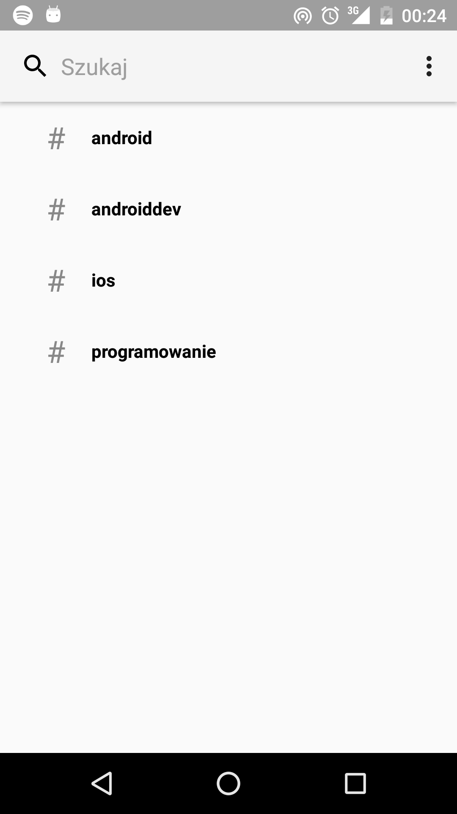
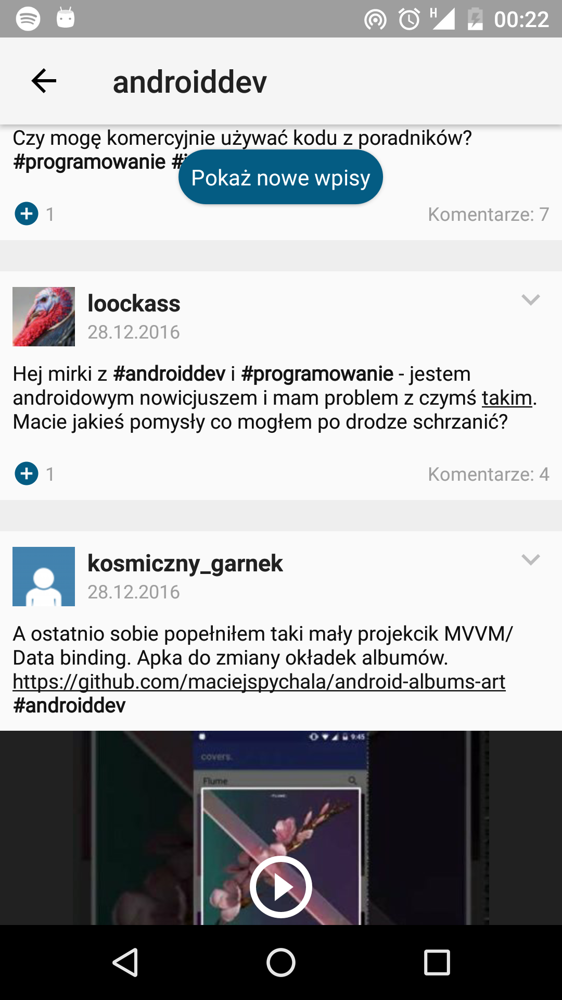

# tagop

This project was brought to life to:
 - apply Facebook [approach](https://code.facebook.com/posts/879498888759525/fast-rendering-news-feed-on-android/)  to rendering complicated list views
 - follow [Android Architecture Blueprints (mvp-dagger)](https://github.com/googlesamples/android-architecture/tree/todo-mvp-dagger/) with emphasis on testing and implementing cache

**Screenshots**

  
  
  

**Gif**

  

